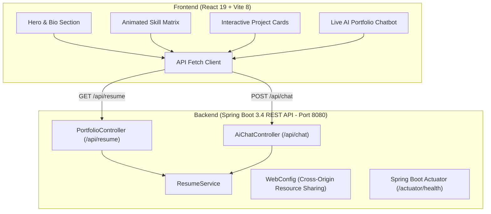

# Ganesh Badar — Java Backend Developer & Systems Architecture Portfolio

[](https://www.oracle.com/java/)
[](https://spring.io/projects/spring-boot)
[](https://maven.apache.org/)
[](https://react.dev/)
[](https://vitejs.dev/)
[](LICENSE)
[](https://ganeshbadar.dev)

A modern, full-stack personal developer portfolio engineered by **Ganesh Badar**.

🌐 **Primary Custom Domain:** [https://ganeshbadar.dev](https://ganeshbadar.dev)  
🔗 **Mirror / GitHub Pages:** [https://ganesh-badar.github.io/portfolio/](https://ganesh-badar.github.io/portfolio/)

### 🚀 Featured Flagship Projects Showcased
- **NexusTech — Full-Stack Enterprise E-Commerce Platform**
  - [Live Demo](https://ganesh-badar.github.io/nexus-ecommerce-platform/) | [GitHub Repository](https://github.com/ganesh-badar/nexus-ecommerce-platform)
  - Java 17, Spring Boot 3, Spring Data JPA, MySQL, React 18, Vite, Bootstrap 5, Docker
- **HireScope AI — Enterprise AI Resume Screener & Real-Time ATS**
  - [Live Demo](https://ganesh-badar.github.io/ai-resume-screener-ats/) | [GitHub Repository](https://github.com/ganesh-badar/ai-resume-screener-ats)
  - Java 17, Spring Boot 3, React 18, MySQL, Server-Sent Events (SSE), OpenAI GPT-4o-mini, AWS S3

Combines a **Spring Boot 3** REST API backend delivering verified resume models and an intelligent query terminal with a high-performance **React + Vite** frontend featuring clean architectural typography, zero-lag micro-interactions, responsive grids, and dedicated legal compliance pages.

---

## 🏛️ System Architecture



---

## ✨ Key Features & Capabilities

### 🎨 Frontend Highlights
- **Glassmorphism UI:** Frosted glass cards with backdrop blur, subtle glows, and responsive grid layouts.
- **Dynamic Content Ingestion:** Fetches real-time portfolio metrics, education, and project stats from the Spring Boot API with fallback resilience.
- **Interactive AI Chatbot:** Floating conversational assistant answering recruiter queries about skills, projects, and contact info in real time.
- **Animated Skill Matrix:** Visual progress bars categorized across Languages, Frameworks, Databases, and Tools.
- **Optimized Bundle:** Sub-second hot-module reloading powered by Vite 8.

### ⚙️ Backend Highlights
- **Layered Clean Architecture:** Strict separation of concerns (Controller &rarr; Service &rarr; Model).
- **RESTful Endpoints:** Serves structured resume models (`ResumeData.java`) with contact details, technical skill proficiency ratings, and project links.
- **Conversational Chatbot Engine:** Keyword analysis and intent-mapping service generating context-aware answers to user queries.
- **CORS Configured:** Pre-configured `WebMvcConfigurer` allowing secure cross-origin communication with the React development server.
- **Production Health Checks:** Integrated Spring Boot Actuator for health monitoring (`/actuator/health`).

---

## 📁 Monorepo Project Structure

```text
portfolio/
├── backend/                             # Spring Boot REST API
│   ├── src/main/java/com/ganesh/portfolio/
│   │   ├── config/WebConfig.java        # CORS Configuration
│   │   ├── controller/
│   │   │   ├── PortfolioController.java # /api/resume endpoints
│   │   │   └── AiChatController.java    # /api/chat conversational assistant
│   │   ├── model/ResumeData.java        # Data transfer models
│   │   ├── service/ResumeService.java   # Business logic & chat intelligence
│   │   └── PortfolioApplication.java    # Application entry point
│   ├── src/main/resources/
│   │   └── application.properties       # Server port & properties
│   └── pom.xml                          # Maven build configuration
│
└── frontend/                            # React 18/19 + Vite Client
    ├── public/                          # Static assets (favicons, profile avatar)
    ├── src/
    │   ├── assets/                      # Graphic assets
    │   ├── App.jsx                      # Main portfolio application & chat widget
    │   ├── index.css                    # Glassmorphism styling & animations
    │   └── main.jsx                     # React root bootstrap
    ├── index.html                       # HTML5 entry with Google Fonts
    ├── vite.config.js                   # Vite configuration
    └── package.json                     # Dependencies & scripts
```

---

## 🚀 Quickstart & Local Setup

### Prerequisites
- **Java 17+** & **Maven 3.8+**
- **Node.js 18+** & **npm**

### 1. Run the Spring Boot Backend
```bash
cd backend
mvn spring-boot:run
```
*The backend server starts on `http://localhost:8080`.*
- Test Resume API: `http://localhost:8080/api/resume`
- Test Health Check: `http://localhost:8080/actuator/health`

### 2. Run the React Frontend
```bash
cd frontend
npm install
npm run dev
```
*The frontend development server starts on `http://localhost:5173`.*

---

## 📡 REST API Reference

| Method | Endpoint | Description |
| :--- | :--- | :--- |
| `GET` | `/api/resume` | Returns complete structured resume, experience, skills, and projects |
| `POST` | `/api/chat` | Accepts `{ "message": "tell me about Ganesh's projects" }` and returns AI response |
| `GET` | `/actuator/health` | Spring Boot Actuator system health status |

---

## 📄 License
This project is open-source under the [MIT License](LICENSE).
